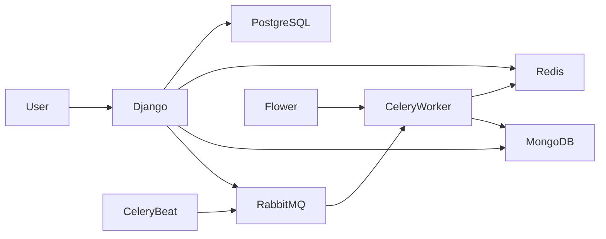

# 🎓 Simple LMS - Advanced Features & Integration

Progress 4 Simple LMS - Advanced Features & Integration

Sistem backend **Simple Learning Management System (LMS)** berbasis **Django Ninja** yang dibuat untuk memenuhi tugas **Progress 4: Advanced Features & Integration** pada mata kuliah **Pemrograman Sisi Server**.

Project ini mengimplementasikan:

- REST API menggunakan Django Ninja
- JWT Authentication
- Role-Based Access Control (RBAC)
- Redis Caching
- MongoDB Activity Logging & Analytics
- Celery Asynchronous Tasks
- RabbitMQ Message Broker
- Flower Monitoring
- Rate Limiting
- Docker Compose Deployment

---

# 👨‍🎓 Identitas Mahasiswa

| Keterangan | Data                               |
| ---------- | ---------------------------------- |
| Nama       | Iqbal Tegar Pratama                |
| NIM        | A11.2023.14969                     |
| Kelas      | Pemrograman Sisi Server (A11.4602) |

---

# 📌 Deskripsi Project

Simple LMS adalah sistem pembelajaran online sederhana yang memungkinkan pengguna untuk:

- Registrasi akun
- Login menggunakan JWT Authentication
- Mengelola course
- Melakukan enrollment course
- Menandai progress pembelajaran
- Menggunakan sistem role (Admin, Instructor, Student)
- Menjalankan background task secara asynchronous
- Menyimpan activity logs ke MongoDB
- Menggunakan Redis sebagai caching layer

---

# 🎯 Tujuan Pembelajaran

Project ini dibuat untuk mempelajari implementasi backend modern menggunakan:

- Django Ninja REST API
- JWT Authentication
- Role-Based Access Control (RBAC)
- PostgreSQL Database
- Redis Caching
- MongoDB Document Storage
- Celery Task Queue
- RabbitMQ Message Broker
- Docker Compose
- Monitoring dengan Flower

---

# 🛠️ Teknologi yang Digunakan

| Teknologi      | Fungsi                          |
| -------------- | ------------------------------- |
| Python 3.11    | Bahasa Pemrograman              |
| Django         | Backend Framework               |
| Django Ninja   | REST API Framework              |
| PostgreSQL     | Relational Database             |
| Redis          | Caching & Celery Result Backend |
| MongoDB        | Activity Logs & Analytics       |
| RabbitMQ       | Message Broker                  |
| Celery         | Asynchronous Task Queue         |
| Flower         | Monitoring Celery               |
| JWT            | Authentication                  |
| Pydantic       | Data Validation                 |
| Swagger UI     | API Documentation               |
| Docker Compose | Container Orchestration         |

---

# 🐳 Docker Services

Project dijalankan menggunakan Docker Compose dengan service berikut:

| Service       | Fungsi               |
| ------------- | -------------------- |
| web           | Django Application   |
| db            | PostgreSQL Database  |
| redis         | Redis Cache          |
| mongodb       | MongoDB Database     |
| rabbitmq      | Message Broker       |
| celery-worker | Celery Worker        |
| celery-beat   | Celery Scheduler     |
| flower        | Monitoring Dashboard |

---

# 🔐 Authentication System

Fitur autentikasi yang tersedia:

- Register User
- Login User
- JWT Access Token
- JWT Refresh Token
- Get User Profile
- Update User Profile

---

# 🛡️ Role-Based Access Control (RBAC)

Role yang tersedia:

| Role       | Hak Akses              |
| ---------- | ---------------------- |
| Admin      | Full Access            |
| Instructor | Create & Manage Course |
| Student    | Enroll Course          |

Permission Decorator:

```python
@is_admin
@is_instructor
@is_student
```

---

# 📚 Course Management

## Public Endpoint

Dapat diakses tanpa login:

- Melihat semua course
- Melihat detail course
- Filter course
- Pagination

## Protected Endpoint

Membutuhkan login:

- Membuat course
- Mengedit course
- Menghapus course

---

# 📝 Enrollment System

Fitur enrollment:

- Student dapat enroll course
- Melihat daftar course yang diikuti
- Menandai progress pembelajaran
- Menyelesaikan course

---

# 🚀 Redis Integration

Redis digunakan untuk meningkatkan performa aplikasi melalui caching.

## Course List Cache

Endpoint:

```http
GET /api/courses
```

Daftar course disimpan di Redis agar tidak selalu mengambil data dari PostgreSQL.

## Course Detail Cache

Endpoint:

```http
GET /api/courses/{id}
```

Detail course disimpan ke Redis untuk mempercepat response.

## Cache Invalidation

Cache akan dihapus ketika:

- Course dibuat
- Course diperbarui
- Course dihapus

Tujuan:

- Menjaga konsistensi data
- Mengurangi query database
- Mempercepat response API

---

# 📊 MongoDB Integration

MongoDB digunakan untuk menyimpan data non-relasional.

## Activity Logs Collection

Mencatat aktivitas pengguna seperti:

- Login
- Enrollment
- Update Course
- Course Completion

## Learning Analytics Collection

Menyimpan data statistik pembelajaran:

- Total enrollment
- Course completion
- Aktivitas pengguna

## Aggregation Reports

MongoDB Aggregation digunakan untuk:

- Statistik enrollment per course
- Statistik penyelesaian course
- Ringkasan aktivitas user

---

# ⚡ Celery Asynchronous Tasks

Project mengimplementasikan 4 background task:

## 1. send_enrollment_email

Mengirim email ketika student berhasil enroll ke course.

## 2. generate_certificate

Membuat sertifikat ketika course selesai.

## 3. update_course_statistics

Scheduled task untuk memperbarui statistik course.

## 4. export_course_report

Generate laporan course dalam format CSV secara asynchronous.

---

# 📨 RabbitMQ Message Broker

RabbitMQ digunakan sebagai broker komunikasi antara Django dan Celery.

Task Flow:

```text
Django → RabbitMQ → Celery Worker
```

RabbitMQ Dashboard:

```text
http://localhost:15672
```

Default Login:

```text
Username: guest
Password: guest
```

---

# 🌸 Flower Monitoring

Flower digunakan untuk memonitor Celery Worker.

URL:

```text
http://localhost:5555
```

Fitur:

- Monitoring worker
- Monitoring task
- Monitoring queue
- Monitoring task success/failure
- Monitoring task execution

---

# ⏱️ Rate Limiting

Rate limiting diterapkan pada endpoint API.

Konfigurasi:

```text
60 requests per minute
```

Tujuan:

- Mencegah abuse API
- Mengurangi beban server
- Menjaga stabilitas aplikasi

---

# 📌 API Endpoint

## Authentication

| Method | Endpoint           |
| ------ | ------------------ |
| POST   | /api/auth/register |
| POST   | /api/auth/login    |
| POST   | /api/auth/refresh  |
| GET    | /api/auth/me       |
| PUT    | /api/auth/me       |

---

## Courses

| Method | Endpoint          |
| ------ | ----------------- |
| GET    | /api/courses      |
| GET    | /api/courses/{id} |
| POST   | /api/courses      |
| PATCH  | /api/courses/{id} |
| DELETE | /api/courses/{id} |

---

## Enrollment

| Method | Endpoint                       |
| ------ | ------------------------------ |
| POST   | /api/enrollments               |
| GET    | /api/enrollments/my-courses    |
| POST   | /api/enrollments/{id}/progress |

---

# 📖 Swagger Documentation

Swagger UI tersedia pada:

```text
http://localhost:8000/api/docs
```

Fitur:

- Melihat endpoint API
- Mencoba endpoint langsung
- Melihat request dan response
- JWT Authorization

---

# 🔑 Contoh Login API

## Register User

```json
{
  "username": "iqbal123",
  "password": "12345678",
  "email": "iqbal@gmail.com",
  "first_name": "Iqbal",
  "last_name": "Pratama"
}
```

## Login

```json
{
  "username": "iqbal123",
  "password": "12345678"
}
```

## Response

```json
{
  "refresh": "xxxxx",
  "access": "xxxxx"
}
```

## Authorize Swagger

Klik tombol **Authorize** lalu masukkan:

```text
Bearer access_token_kamu
```

---

# 📌 Redis CLI Documentation

Masuk ke Redis:

```bash
docker exec -it simplelms-redis-1 redis-cli
```

Tes koneksi:

```redis
PING
```

Output:

```text
PONG
```

Melihat key:

```redis
KEYS *
```

Menghapus key:

```redis
DEL nama_key
```

---

# 🗺️ Architecture Diagram



---

# 🔄 Task Flow Documentation

1. User mengakses endpoint course
2. Django memeriksa Redis cache
3. Jika cache tersedia, data dikembalikan dari Redis
4. Jika cache tidak tersedia, data diambil dari PostgreSQL
5. Data disimpan ke Redis
6. User melakukan enrollment
7. Django mengirim task ke RabbitMQ
8. Celery Worker memproses task
9. Aktivitas dicatat ke MongoDB
10. Flower memonitor seluruh task

---

# 📷 Screenshot Pengujian

Lampirkan screenshot berikut pada laporan atau repository:

1. Docker Compose Services (`docker ps`)
2. Swagger UI (`/api/docs`)
3. Register User Berhasil
4. Login User Berhasil
5. JWT Authorization Berhasil
6. GET User Profile
7. Flower Dashboard
8. RabbitMQ Dashboard
9. Redis CLI (`PING`, `KEYS *`)
10. MongoDB Collections (`show collections`)

---

# 🧪 Testing

Pengujian dilakukan menggunakan:

- Swagger UI
- Postman
- RabbitMQ Management Dashboard
- Flower Monitoring Dashboard
- Redis CLI
- MongoDB Shell

---

# 📁 Struktur Project

```text
simple-lms
│
├── core
│   ├── api.py
│   ├── models.py
│   ├── tasks.py
│   ├── mongo.py
│   ├── schemas.py
│   └── auth.py
│
├── simplelms
│   ├── settings.py
│   ├── urls.py
│   ├── celery.py
│   └── wsgi.py
│
├── docker-compose.yml
├── Dockerfile
├── requirements.txt
├── README.md
└── manage.py
```

---

# 📁 Kriteria Penilaian yang Dipenuhi

✅ Redis Integration

✅ MongoDB Integration

✅ Celery Tasks (4 Tasks)

✅ RabbitMQ Message Broker

✅ Docker Compose Services

✅ Flower Monitoring

✅ JWT Authentication

✅ Swagger Documentation

✅ Role-Based Access Control (RBAC)

✅ Rate Limiting

---

# 👨‍💻 Author

**Iqbal Tegar Pratama**

**NIM:** A11.2023.14969

**Kelas:** Pemrograman Sisi Server (A11.4602)

---

# ⭐ Penutup

Project ini dibuat sebagai implementasi backend modern menggunakan Django Ninja dengan dukungan Redis, MongoDB, RabbitMQ, Celery, Flower, JWT Authentication, Rate Limiting, dan Docker Compose.

Seluruh fitur dikembangkan untuk memenuhi kebutuhan tugas **Progress 4: Advanced Features & Integration** pada mata kuliah **Pemrograman Sisi Server**.
# Progress-4-Simple-LMS-Advanced-Features-Integration

